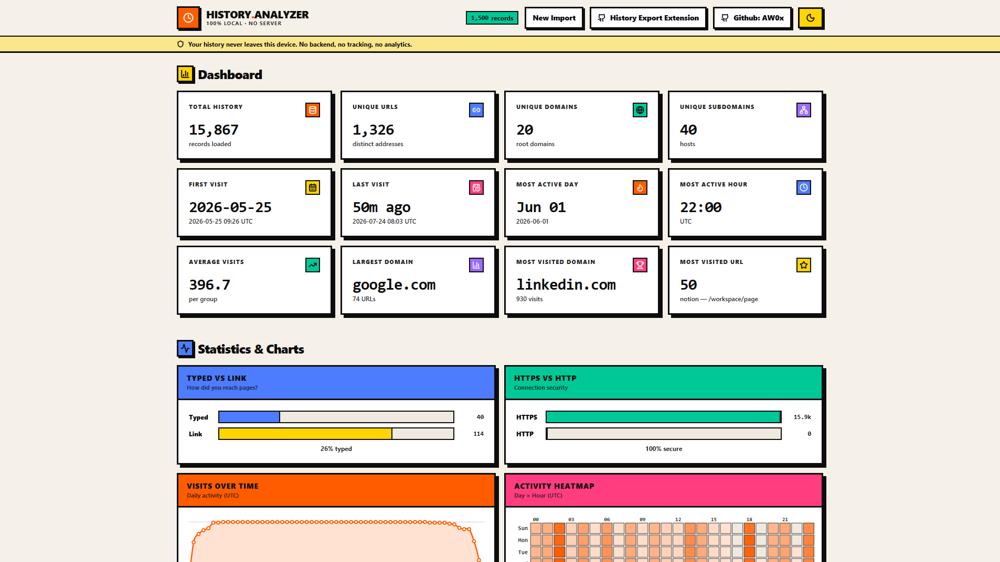

# Browser History Analyzer

A privacy-first, client-side web app to import, explore, and visualize your Chrome browser history. Built with **Svelte 5**, **SvelteKit**, **TailwindCSS 4**, and **TypeScript** — no backend, no database, no tracking. Your history never leaves your device.

  



## Features

- **Drag & drop / file-picker import** of JSON from [Quick Chrome History Export](https://chromewebstore.google.com/detail/quick-chrome-history-expo/acjbkgbpefalkaebgodhnbdgjbignonj)
- **Robust validation** — friendly errors for invalid/corrupted/empty/wrong-type files
- **URL normalization** — protocol, hostname, domain, subdomain, TLD, root domain (computed once)
- **Multi-level deduplication** — aggregates visits by URL, domain, and subdomain
- **Dashboard** with 11 headline stats (total/unique, first/last visit, most active day/hour, largest/most-visited domain/URL, etc.)
- **Fuzzy search** (Fuse.js) across title, URL, domain, subdomain — with match highlighting
- **Filters** — sort (A-Z, visits, recency), timeline (today/yesterday/7d/30d/custom), min-visits, transition, protocol, TLD, bookmarks-only
- **History cards** with favicon, stats, time info, bookmark, copy-domain, visit & view-URLs actions
- **URL modal** showing all URLs in a group, with shortened long URLs + tooltips
- **Lightweight SVG charts** — bar, line, heatmap (day × hour), timeline sparkline (no chart libraries)
- **Bookmarks** with animated toggle, persisted to localStorage
- **Export** filtered data as pretty-printed JSON
- **Dark mode** — no flash, respects system preference, persists choice
- **Virtualized grid** for 100k+ records
- **Accessible** — keyboard nav, ARIA labels, semantic HTML, visible focus, reduced-motion support, skip-to-content link
- **Responsive** — desktop / tablet / phone, portrait & landscape

## Tech Stack

| Layer | Choice |
|-------|--------|
| Framework | Svelte 5 (runes) + SvelteKit |
| Adapter | `@sveltejs/adapter-static` (SPA fallback) |
| Styling | TailwindCSS 4 (CSS-first config) |
| Language | TypeScript (strict) |
| Build | Vite |
| Fuzzy search | Fuse.js |
| Dates | date-fns |
| Icons | lucide-svelte |
| Utils | clsx |

No component library. No UI framework. No chart library.

## Getting Started

```sh
# Install dependencies
npm install

# Start the dev server
npm run dev

# Type-check
npm run check

# Production build (outputs to ./build)
npm run build

# Preview the production build
npm run preview
```

## Architecture

```
src/
├── app.css                 # Neo-Brutalism design system (Tailwind v4 @theme)
├── app.html                # Shell with no-flash theme script + manifest
├── types/                  # Strict TypeScript contracts
│   ├── history.ts          # Raw / normalized / grouped history shapes
│   ├── stats.ts            # Stats + distribution shapes
│   └── app.ts              # Filters, theme, toast, status
├── stores/                 # Svelte 5 rune stores (.svelte.ts)
│   ├── theme.svelte.ts     # Theme (persisted, system-synced)
│   ├── data.svelte.ts      # App data + filters + progress
│   ├── ui.svelte.ts        # Toasts + bookmarks
│   └── derived.svelte.ts   # Memoized filter/search/sort pipeline
├── history/                # Pure business logic (no UI)
│   ├── import.ts           # File validation + schema check
│   ├── normalize.ts        # URL breakdown + favicon helpers
│   ├── group.ts            # Dedupe + aggregate into groups
│   ├── stats.ts            # Headline stats + distributions
│   ├── sample.ts           # Deterministic sample data
│   └── pipeline.ts         # Orchestrates the full import flow
├── utils/                  # Pure helpers
│   ├── date.ts             # UTC date formatting
│   ├── format.ts           # Numbers, clipboard, URL shortening
│   ├── async.ts            # Debounce, yield-to-event-loop
│   ├── chart.ts            # SVG scale / path / tick helpers
│   └── highlight.ts        # Search match highlighting
├── components/              # Reusable UI (one concern per file)
│   ├── charts/             # ChartCard, Bar, Line, Heatmap, Timeline
│   ├── cards/              # HistoryCard, HistoryGrid (virtualized)
│   ├── filters/            # SearchBox, FilterBar
│   ├── modal/              # UrlModal
│   ├── AppHeader / Footer / Dashboard / StatCard / …
└── routes/
    └── +page.svelte        # Single-page orchestration
```

### Data flow

```
file → validateFile → parseHistoryFile → validateSchema
      → normalizeEntries (URL breakdown, once)
      → groupHistory (dedupe + aggregate by domain/subdomain)
      → computeStats + computeDistribution
      → dataStore.setData
      → derivedStore.filtered (search + filters + sort, memoized)
      → HistoryGrid (virtualized render)
```

All business logic lives in `src/history/` and `src/utils/` as pure functions — the UI in `src/components/` only reads from stores and renders.

## Import Format

The app accepts JSON from the Quick Chrome History Export extension. Each item:

```ts
{
  id: string;
  history_id?: string;
  title?: string;
  url: string;
  visitTime: number;      // epoch ms
  visitCount?: number;
  typedCount?: number;
  transition?: string;
  isLocal?: boolean;
}
```

Both bare arrays `[…]` and wrapped `{ history: […] }` shapes are accepted.

## Privacy

- No backend, no server, no database, no authentication.
- No analytics or tracking scripts.
- The only outbound request is to Google's favicon service (`google.com/s2/favicons`), which receives only the public domain — never your history.
- Theme, bookmarks, and sort preference are stored in `localStorage` on your device only.

## License

MIT
